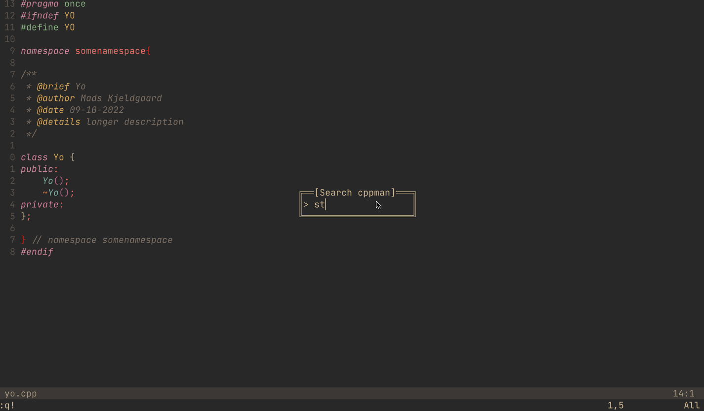

# CPPMan.nvim



A Neovim plugin for the [cppman CLI](https://github.com/aitjcize/cppman), so you can search cplusplus.com and cppreference.com without leaving Neovim.

This plugin started as a copy of [madskjeldgaard/cppman.nvim](https://github.com/madskjeldgaard/cppman.nvim), with full credit to Mads for the original work.

This fork adds sizing options and a few workflow improvements.

## Installation

Install with [lazy.nvim](https://github.com/folke/lazy.nvim). [nui.nvim](https://github.com/MunifTanjim/nui.nvim) is required.

Use `version = "*"` to follow the latest stable release.

```lua
{
	"simonwinther/cppman.nvim",
	version = "*",
	event = "VeryLazy",
	dependencies = {
		"MunifTanjim/nui.nvim",
	},
	opts = {
		input_width = 30,
		popup_width = "90%",
		popup_height = "80%",
	},
}
```

## Usage

Run `:CPPMan` to open the search prompt, or pass a term directly: `:CPPMan std::array`

Using `event = "VeryLazy"` is enough here. You do not need a separate `keys` entry in your `lazy.nvim` spec unless you want to manage the mappings yourself.

Default keymaps:

* `<leader>cu` opens CPPMan for the word under the cursor
* `<leader>ck` opens the CPPMan search prompt

Override the default keymaps in `setup()` if needed:

```lua
{
	"simonwinther/cppman.nvim",
	version = "*",
	event = "VeryLazy",
	dependencies = {
		"MunifTanjim/nui.nvim",
	},
	opts = {
		keymaps = {
			open_under_cursor = "<leader>mu",
			search = "<leader>mk",
		},
	},
}
```

Default options:

```lua
require("cppman").setup({
	input_width = 20,
	popup_width = "80%",
	popup_height = "60%",
	keymaps = {
		open_under_cursor = "<leader>cu",
		search = "<leader>ck",
	},
})
```

## Navigation
In normal mode, the manual uses the same navigation as standalone `cppman`:

* **K**, **<C-]>**, and **<2-LeftMouse>** follow the word under the cursor
* **\<C-T\>** and **\<RightMouse\>** go back to the previous page
